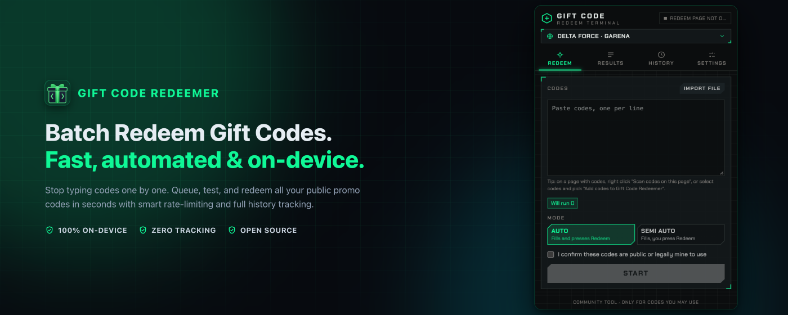
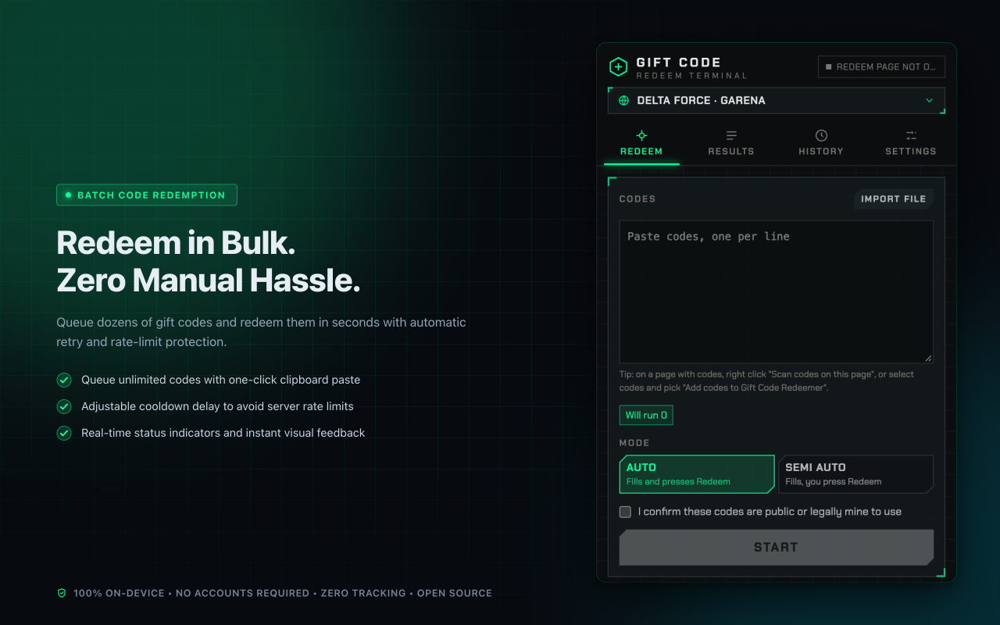
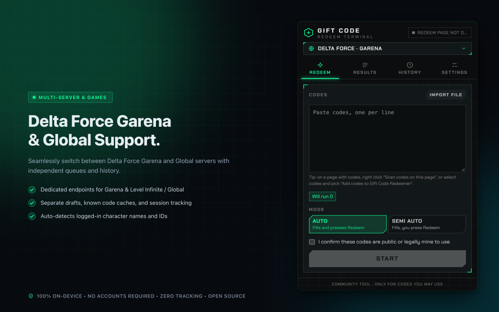
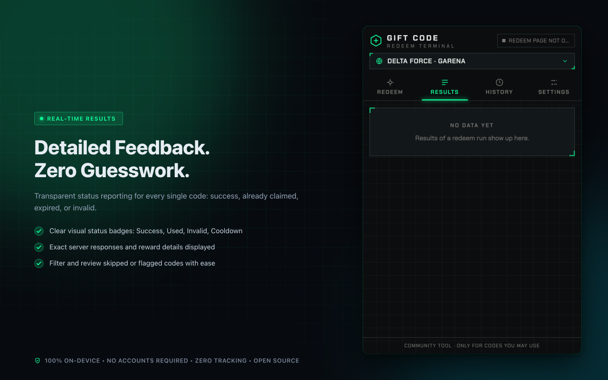
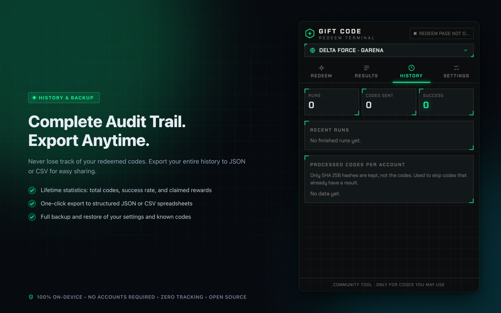
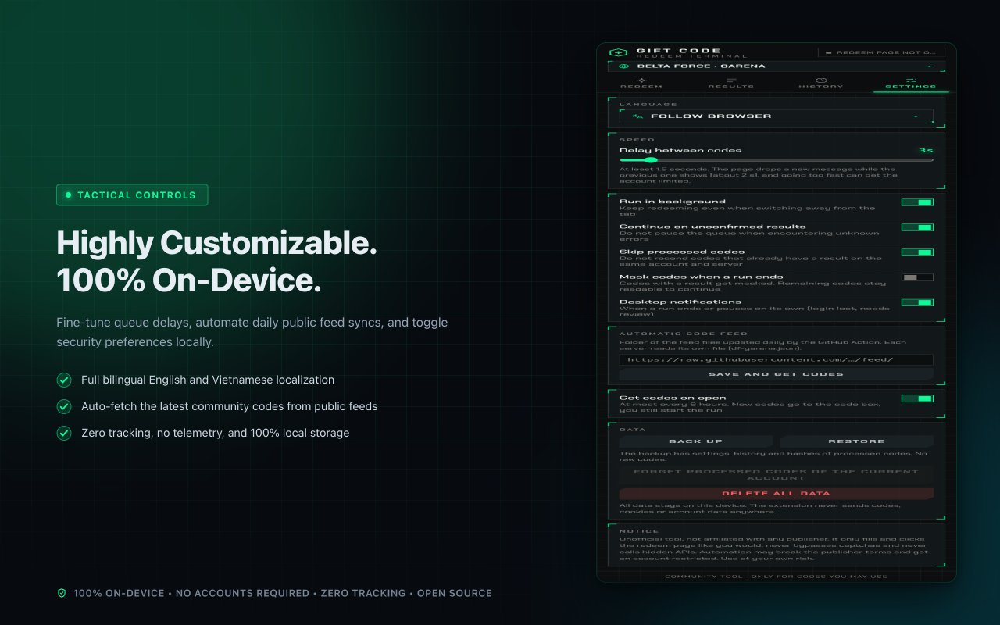

<p align="center">
  
</p>

<h1 align="center">Gift Code Redeemer</h1>

<p align="center">
  <strong>Batch redeem gift codes automatically. Fast, secure, and 100% on-device.</strong>
</p>

<p align="center">
  <em>Collects public promo codes daily and redeems them automatically from a high-performance browser extension built with WXT, Svelte 5, and Tailwind CSS.</em>
</p>

<p align="center">
  <a href="https://github.com/Nam088/giftcode-hub/actions/workflows/release.yml"></a>
  <a href="https://github.com/Nam088/giftcode-hub/actions/workflows/scrape-codes.yml"></a>
  <a href="https://github.com/Nam088/giftcode-hub/releases"></a>
  
  <a href="LICENSE"></a>
</p>

<p align="center">
  <strong>English</strong> • <a href="README.vi.md">Tiếng Việt</a>
</p>

<p align="center">
  
</p>

---

## Key Features

- **Bulk Code Redemption**: Queue dozens of gift codes with a single click. Eliminates manual copy-pasting and repetitive captcha/submission fatigue.
- **Multi-Server & Game Adapters**: Dedicated support for **Delta Force Garena (SEA)** and **Delta Force Global** with separate drafts, job queues, and history records.
- **Smart Anti-Throttle Controls**: Adjustable cooldown delay slider between requests to avoid game server rate limits or account flags.
- **Automated Daily Community Feeds**: Scheduled GitHub Action automatically collects and updates valid community gift codes daily.
- **Detailed Real-Time Feedback**: Instant status classification (**Success**, **Used**, **Invalid**, **Expired**) with server response details.
- **Complete Audit Trail & Data Export**: Lifetime history statistics with one-click export to structured **JSON** and **CSV** spreadsheets.
- **100% On-Device & Zero Tracking**: Operates entirely within your local browser. Never contacts unauthorized third-party servers, never captures passwords or cookies.

---

## App Preview

| **Batch Code Redemption** | **Multi-Server Support** |
| :---: | :---: |
|  |  |
| **Real-Time Results Breakdown** | **Complete History & Export** |
|  |  |

<p align="center">
  
</p>

---

## Supported Sites

Each game and server operates through an independent adapter with its own queue, history, feed, and processed code cache:

| Site ID | Game / Server | Official Redeem Page | Notes |
| :--- | :--- | :--- | :--- |
| `df-garena` | Delta Force · Garena (SEA) | `redeem.df.garena.sg/<lang>/cdkgarena.html` | Log in first via official Garena web session |
| `df-global` | Delta Force · Global | `www.playdeltaforce.com/<lang>/cdkredeem.html` | Log in first via official Level Infinite portal |

Adapters are located in `src/lib/sites/<game>/<server>.ts` and registered in `src/lib/sites/index.ts`. All localized game messages are compiled from official page dictionaries using `pnpm gen:df-messages`.

---

## Daily Code Feed

The repository includes an automated scraper (`.github/workflows/scrape-codes.yml`) that runs daily at **08:17 (UTC+7)** to update public community gift codes.

Feeds are segregated by server:
- `feed/df-garena.json` (Vietnamese & SEA sources)
- `feed/df-global.json` (International & English sources)

### 3-Layer Duplicate Defense

1. **Feed Layer**: JSON is keyed by normalized code strings. Codes appearing across multiple articles are stored once with timestamp tracking (`firstSeen`, `lastSeen`, `sources`). Codes inactive for 180+ days are pruned automatically.
2. **Draft Box Layer**: Synchronizing feeds only appends new, unhandled codes without touching existing drafts.
3. **Account & Site Layer**: Codes that already received a conclusive result on the current account are hashed with **SHA-256** and skipped automatically.

To configure automated sync, paste the public feed folder into the extension settings:

```text
https://raw.githubusercontent.com/Nam088/giftcode-hub/main/feed/
```

*(Each game adapter automatically resolves its own `<feedKey>.json` file).*

---

## Development & Build Commands

| Command | Description |
| :--- | :--- |
| `pnpm dev` | Start development server with HMR for Chromium |
| `pnpm dev:firefox` | Start development server for Firefox MV2 |
| `pnpm build` | Compile extension production bundles into `.output/` |
| `pnpm zip` | Package release zip archives for Chrome Web Store |
| `pnpm zip:firefox` | Package release zip archives for Firefox Add-ons |
| `pnpm test` | Run unit tests with Vitest |
| `pnpm e2e` | Run full Playwright integration tests with mock server |
| `pnpm lint` / `pnpm check` | Run Biome linter and Svelte type-checking |
| `pnpm scrape` | Scrape and update daily gift codes into `feed/` |
| `pnpm gen:icons` | Generate clean icons (16, 32, 48, 128, 512) from SVG |
| `pnpm screenshots:store` | Render 5 Chrome Web Store screenshots (1280x800, 24-bit RGB) |
| `pnpm promos:store` | Render Chrome Web Store promo tiles (440x280 & 1400x560) |
| `pnpm assets:store` | Generate all store screenshots and promotional artwork |
| `pnpm browser` | Launch persistent Chrome for Testing profile with extension loaded |

---

## Release Pipeline

This project features an automated GitHub Actions release workflow ([`.github/workflows/release.yml`](.github/workflows/release.yml)):

- **Trigger**: Pushing a tag matching `v*` (e.g. `git tag v0.1.0 && git push origin v0.1.0`) or manual workflow dispatch.
- **Verification Gates**: Runs `lint`, `check`, `test`, and `e2e` tests before any build artifacts are packaged.
- **Artifacts**: Automatically publishes a GitHub Release containing `.zip` bundles, SHA-256 checksums, and store promotional artwork.

---

## Disclaimer

This is an open-source community tool and is **not affiliated with, endorsed by, or sponsored by Garena, Tencent, or Level Infinite**. 

The extension interacts only with official web redemption forms in the exact same manner as human clicks. It does not bypass security captchas, reverse engineer proprietary binaries, or access unlisted internal APIs. Users must ensure compliance with the publisher's terms of service and use only authorized public codes.
