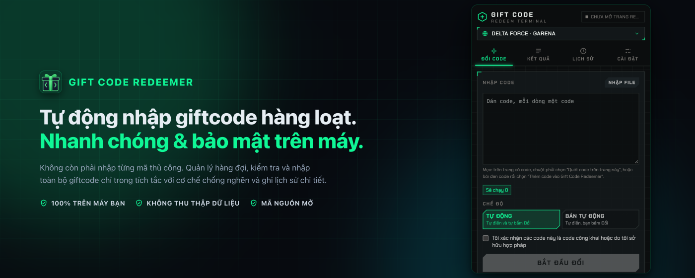
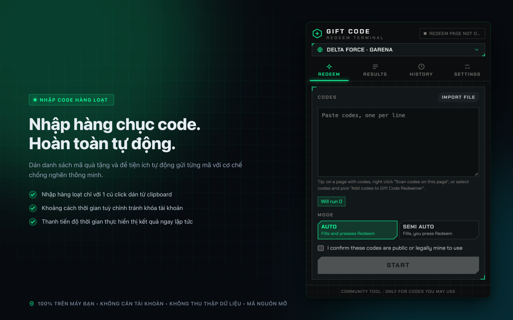
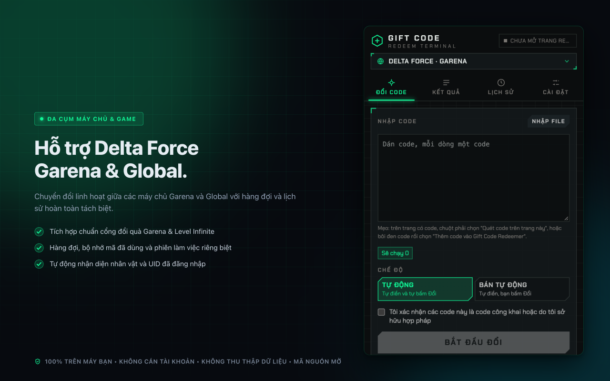
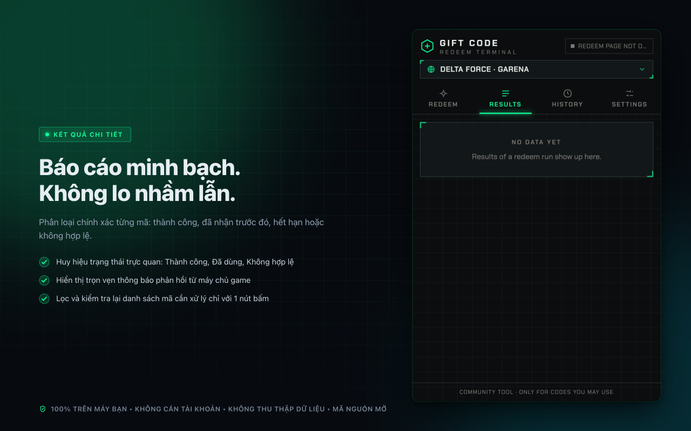
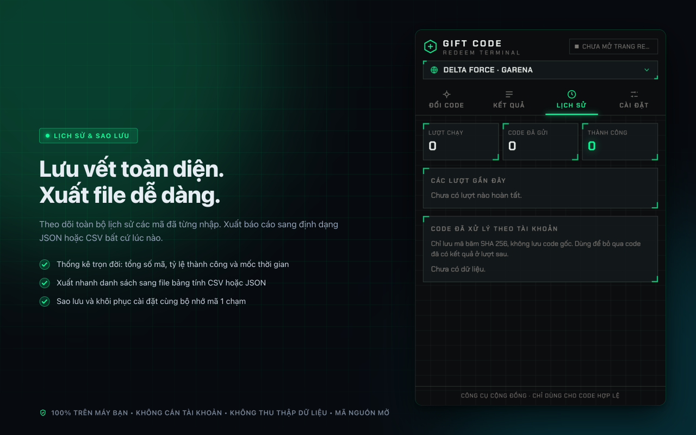
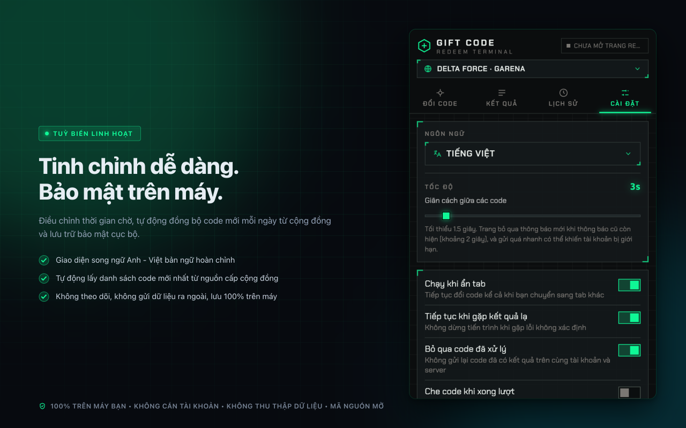

<p align="center">
  
</p>

<h1 align="center">Gift Code Redeemer</h1>

<p align="center">
  <strong>Tự động nhập giftcode hàng loạt. Nhanh chóng, an toàn và 100% trên thiết bị.</strong>
</p>

<p align="center">
  <em>Thu thập mã quà tặng công khai hằng ngày và tự động nhập mã qua tiện ích trình duyệt hiệu năng cao xây dựng bằng WXT, Svelte 5 và Tailwind CSS.</em>
</p>

<p align="center">
  <a href="https://github.com/Nam088/giftcode-hub/actions/workflows/release.yml"></a>
  <a href="https://github.com/Nam088/giftcode-hub/actions/workflows/scrape-codes.yml"></a>
  <a href="https://github.com/Nam088/giftcode-hub/releases"></a>
  
  <a href="LICENSE"></a>
</p>

<p align="center">
  <a href="README.md">English</a> • <strong>Tiếng Việt</strong>
</p>

<p align="center">
  
</p>

---

## Tính năng nổi bật

- **Nhập mã hàng loạt tự động**: Dán hàng chục mã quà tặng cùng lúc chỉ với 1 cú click. Không còn phải sao chép, dán thủ công và bấm đổi từng mã mệt mỏi.
- **Hỗ trợ đa máy chủ & cụm game**: Tích hợp sẵn cho **Delta Force Garena (SEA)** và **Delta Force Global** với hàng đợi, bộ nhớ nháp và lịch sử hoàn toàn riêng biệt.
- **Cơ chế chống nghẽn & giới hạn tần suất**: Thanh trượt điều chỉnh khoảng cách (delay) giữa các lần gửi mã, giúp tránh tình trạng máy chủ phản hồi chậm hoặc tạm khóa chức năng.
- **Tự động cập nhật code cộng đồng**: GitHub Action chạy định kỳ mỗi ngày thu thập và làm mới danh sách giftcode công khai còn hạn sử dụng.
- **Báo cáo kết quả trực quan theo thời gian thực**: Phân loại kết quả tức thì (**Thành công**, **Đã nhận**, **Không hợp lệ**, **Hết hạn**) kèm nội dung thông báo chuẩn xác từ máy chủ.
- **Lưu vết toàn diện & xuất báo cáo**: Thống kê lịch sử trọn đời, hỗ trợ xuất danh sách sang định dạng bảng tính **CSV** hoặc file **JSON** chỉ với 1 nút bấm.
- **100% trên thiết bị & bảo mật tuyệt đối**: Tiện ích chạy hoàn toàn cục bộ trên trình duyệt của bạn. Tuyệt đối không gửi tài khoản, mật khẩu, cookie hay dữ liệu cá nhân ra máy chủ bên thứ ba.

---

## Hình ảnh giao diện (App Preview)

| **Nhập code hàng loạt** | **Hỗ trợ đa máy chủ** |
| :---: | :---: |
|  |  |
| **Báo cáo kết quả chi tiết** | **Lịch sử & xuất dữ liệu** |
|  |  |

<p align="center">
  
</p>

---

## Các cổng đổi quà hỗ trợ

Mỗi máy chủ và cụm game hoạt động qua một adapter độc lập, quản lý riêng bộ nhớ nháp, phiên làm việc, nguồn cấp và mã đã xử lý:

| Mã Server | Game / Cụm Máy Chủ | Trang Đổi Quà Chính Thức | Ghi chú |
| :--- | :--- | :--- | :--- |
| `df-garena` | Delta Force · Garena (SEA) | `redeem.df.garena.sg/<lang>/cdkgarena.html` | Đăng nhập tài khoản trước trên trang chính thức của Garena |
| `df-global` | Delta Force · Global | `www.playdeltaforce.com/<lang>/cdkredeem.html` | Đăng nhập tài khoản trước qua cổng Level Infinite |

Các adapter nằm tại thư mục `src/lib/sites/<game>/<server>.ts` và được đăng ký trong `src/lib/sites/index.ts`. Toàn bộ thông báo phản hồi được trích xuất tự động từ gói ngôn ngữ của trang đổi quà bằng lệnh `pnpm gen:df-messages`.

---

## Nguồn cấp code tự động hằng ngày (Daily Feed)

Kho lưu trữ có sẵn workflow tự động (`.github/workflows/scrape-codes.yml`) chạy hằng ngày vào lúc **08:17 sáng (giờ Việt Nam)** để thu thập các mã quà tặng mới nhất từ cộng đồng.

Nguồn cấp được phân chia theo máy chủ:
- `feed/df-garena.json` (Dành cho máy chủ Garena / nguồn tiếng Việt)
- `feed/df-global.json` (Dành cho máy chủ Global / nguồn quốc tế)

### Cơ chế chống trùng lặp 3 lớp

1. **Lớp nguồn cấp (Feed)**: Dữ liệu được đánh chỉ mục theo chuỗi mã chuẩn hóa. Một mã xuất hiện trên nhiều bài viết khác nhau chỉ được lưu một lần kèm mốc thời gian (`firstSeen`, `lastSeen`, `sources`). Các mã không còn xuất hiện sau 180 ngày sẽ được tự động dọn dẹp.
2. **Lớp ô nhập nháp (Draft)**: Khi đồng bộ, tiện ích chỉ thêm vào ô nhập các mã mới mà bạn chưa có trong danh sách.
3. **Lớp tài khoản & máy chủ**: Các mã đã từng có kết quả xác định trên tài khoản hiện tại sẽ được mã hóa bằng hàm băm **SHA-256** và tự động bỏ qua ở các lượt chạy sau.

Để bật tính năng tự đồng bộ, bạn chỉ cần dán đường dẫn thư mục feed công khai vào phần Cài đặt của tiện ích:

```text
https://raw.githubusercontent.com/Nam088/giftcode-hub/main/feed/
```

*(Mỗi adapter game sẽ tự động đọc file `<feedKey>.json` tương ứng).*

---

## Các lệnh phát triển & đóng gói

| Lệnh | Mô tả |
| :--- | :--- |
| `pnpm dev` | Khởi chạy môi trường phát triển (HMR) cho Chrome |
| `pnpm dev:firefox` | Khởi chạy môi trường phát triển cho Firefox MV2 |
| `pnpm build` | Biên dịch bản build hoàn chỉnh vào thư mục `.output/` |
| `pnpm zip` | Đóng gói file `.zip` phát hành cho Chrome Web Store |
| `pnpm zip:firefox` | Đóng gói file `.zip` phát hành cho Firefox Add-ons |
| `pnpm test` | Chạy bộ kiểm thử đơn vị (Unit Tests) với Vitest |
| `pnpm e2e` | Chạy bộ kiểm thử tích hợp đầu-cuối (E2E) với Playwright |
| `pnpm lint` / `pnpm check` | Kiểm tra định dạng code (Biome) và kiểm tra kiểu Svelte |
| `pnpm scrape` | Thu thập mã quà tặng mới từ các nguồn cộng đồng vào `feed/` |
| `pnpm gen:icons` | Kết xuất các kích thước icon chuẩn (16, 32, 48, 128, 512) từ file SVG |
| `pnpm screenshots:store` | Kết xuất tự động 5 ảnh Store (1280x800, 24-bit RGB) cho EN & VI |
| `pnpm promos:store` | Kết xuất tự động ảnh bìa Store (440x280 và 1400x560) cho EN & VI |
| `pnpm assets:store` | Chạy tạo toàn bộ ảnh Store và ảnh quảng bá cùng lúc |
| `pnpm browser` | Khởi động trình duyệt kiểm thử độc lập mang theo tiện ích |

---

## Quy trình Release CI tự động

Dự án được tích hợp workflow GitHub Actions Release tự động ([`.github/workflows/release.yml`](.github/workflows/release.yml)):

- **Cơ chế kích hoạt**: Đẩy tag phiên bản mới bắt đầu bằng chữ `v` (ví dụ: `git tag v0.1.0 && git push origin v0.1.0`) hoặc kích hoạt thủ công trong mục Actions.
- **Cổng kiểm tra chất lượng**: Tự động chạy toàn bộ các bước `lint`, `check`, `test` và `e2e` trước khi đóng gói.
- **Phát hành tự động**: Tạo bản **GitHub Release** hoàn chỉnh đính kèm các file `.zip`, mã băm xác thực SHA-256 và toàn bộ bộ ảnh Store.

---

## Tuyên bố miễn trừ trách nhiệm (Disclaimer)

Đây là công cụ mã nguồn mở phát triển vì cộng đồng và **hoàn toàn không liên kết, không được chứng thực hoặc tài trợ bởi Garena, Tencent hay Level Infinite**.

Tiện ích chỉ tương tác trực tiếp trên form giao diện đổi quà chính thức như thao tác gõ và bấm chuột của người dùng thực tế. Tiện ích không vượt captcha, không can thiệp vào mã nhị phân của game và không gọi API nội bộ không công khai. Người dùng vui lòng tuân thủ điều khoản dịch vụ của nhà phát hành và chỉ sử dụng các mã quà tặng hợp lệ được phát hành công khai.
